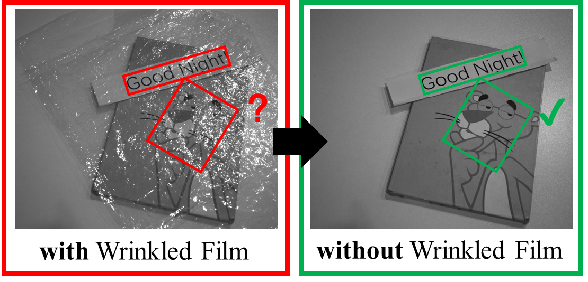
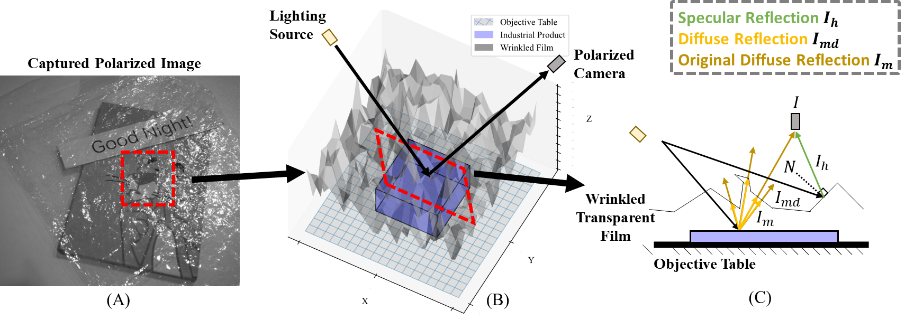
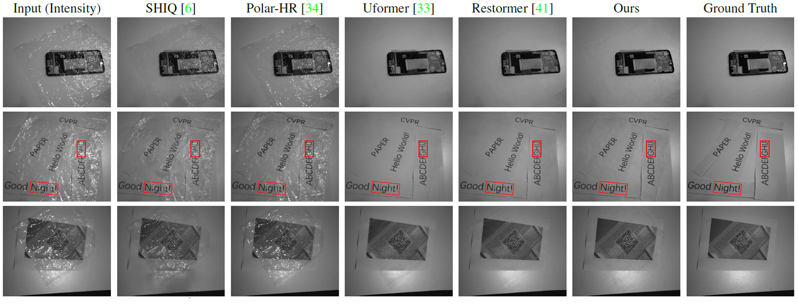
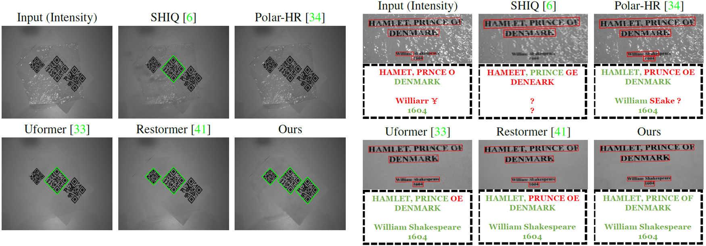

<div align="center">


# [CVPR 2024] Film Removal
<div align="center">
  
</div>

### This is the official repository for [Learning to Remove Wrinkled Transparent Film with Polarized Prior](https://arxiv.org/abs/2403.04368) (CVPR 2024) 

[Jiaqi Tang](https://jqt.me/), [Ruizheng Wu](https://scholar.google.com/citations?user=OOagpAcAAAAJ&hl=en), [Xiaogang Xu](https://xuxiaogang.com/), [Sixing Hu](https://david-husx.github.io/) and [Ying-Cong Chen*](https://www.yingcong.me/)

*: Corresponding Author

[](https://github.com/jqtangust/FilmRemoval/blob/master/LICENSE) [](https://code.visualstudio.com/) [](https://badges.strrl.dev)

Here is our [Project Page](https://jqt.me/_FilmRemoval_/) !

</div>

## 🔍 **New Problem in Low-level Vision**: Film Removal
- 🚩 Goal: Film Removal (FR) aims to remove the interference of wrinkled transparent films and reconstruct the original information under the films. 
- 🚩This technique is used in industrial recognition systems.

<div align="center">
  
</div>


## 📢 **News and Updates**

- ✅ May 28, 2024. We release the pre-trained model of Film Removal in K-ford. Check this Google Cloud link for [DOWNLOAD](https://drive.google.com/file/d/13Cn7tX5bFBxsYZG1Haw5VcqhSxWnNzMW/view?usp=sharing).
- ✅ May 06, 2024. We release the code of Film Removal.
- ✅ May 06, 2024. We release the dataset of Film Removal. Check this Google Cloud link for [DOWNLOAD](https://drive.google.com/file/d/1oi2KyF1ShQqaoF38A02OupDZ4CNvEap3/view?usp=sharing).


## ▶️ **Getting Started**

<!-- 1. [Installation](#installation)
2. [Dataset](#dataset)
3. [Configuration](#configuration)
5. [Testing](#Testing)
4. [Training](#Training) -->

### 🪒 *Installation*
- *Python >= 3.8.2*
- *PyTorch >= 1.8.1*
- *Install [Polanalyser](https://github.com/elerac/polanalyser) for processing polarization image*
    ```
    pip install git+https://github.com/elerac/polanalyser
    ```
- *Install other dependencies by*
    ```
    pip install -r requirements.txt
    ```


### 💾 *Dataset Preparation*

- Google Drive Link for [DOWNLOAD](https://drive.google.com/file/d/1oi2KyF1ShQqaoF38A02OupDZ4CNvEap3/view?usp=sharing) dataset.
- Data Structure: each `K*` directory contains the data for one fold of the dataset. The `GT` directory contains the ground truth images, and the `input` directory contains the input images at different polarized angles.
- The dataset is organized as follows:

    ```
    ├── K1
    │   ├── GT
    │   │   └── 2DCode
    │   │       └── 1_gt_I.bmp
    │   └── input
    │       └── 2DCode
    │           ├── 1_input_0.bmp
    │           ├── 1_input_45.bmp
    │           ├── 1_input_90.bmp
    │           └── 1_input_135.bmp
    ├── K2
    │   ├── ...
    ├── ...
    └── K10
        ├── ...
    ```

### 🏰 *Pretrained Model*
- Google Drive Link for downloading our [Pretrained Model](https://drive.google.com/file/d/13Cn7tX5bFBxsYZG1Haw5VcqhSxWnNzMW/view?usp=sharing) in K-Ford.

### 🔨 *Configuration*

- The configuration files for [`testing`](FilmRemoval/codes/options/test/test.yml) and [`training`](FilmRemoval/codes/options/train/train.yml).

- The Test_K_ford option specifies the number of folds for K-fold cross-validation during testing. The dataroot option specifies the root directory for the dataset, which is set to Dataset. Other configuration settings include learning rate schemes, loss functions, and logger options.

  ```
  datasets:
    train:
      name: Reconstruction
      mode: LQGT_condition
      Test_K_ford: K10 # remove from training
      dataroot: /remote-home/share/jiaqi2/Dataset
      dataroot_ratio: ./
      use_shuffle: true
      n_workers: 0
      batch_size: 1
      GT_size: 0
      use_flip: true
      use_rot: true
      condition: image
    val:
      name: Reconstruction
      mode: LQGT_condition_Val
      Test_K_ford: K10 # for testing
      dataroot: /remote-home/share/jiaqi2/Dataset
      dataroot_ratio: ./
      condition: image
  ```

### ⏳ *Testing*

- Modify `dataroot`, `Test_K_ford` and `pretrain_model_G` in [`testing`](FilmRemoval/codes/options/train/test.yml) configuration, then run
  ```
  python test.py -opt ./codes/options/test/test.yml
  ```
- The test results will be saved to `./results/testset_name`, including `Restored Image` and `Prior`. 

### 🖥️ *Training*


- Modify `dataroot` and `Test_K_ford` in [`training`](FilmRemoval/codes/options/train/train.yml) configuration, then run
  ```
  python train.py -opt ./codes/options/train/train.yml
  ```
- The logs, models and training states will be saved to `./experiments/name`. You can also use `tensorboard` for monitoring for the `./tb_logger/name`.

- Restart Training (To add checkpoint in [`training`](FilmRemoval/codes/options/train/train.yml) configuration)
  ```
  path:
    root: ./
    pretrain_model_G: .../experiments/K1/models/XX.pth
    strict_load: false
    resume_state: .../experiments/K1/training_state/XX.state
  ```


## ⚡ **Performance**
Compared with other baselines, our model achieves state-of-the-art performance:

> ⭐ **[Table 1] Quantitative evaluation in image reconstruction with 10-fold cross-validation.**
> | Methods | PSNR | SSIM |
> |---------|------|------|
> | SHIQ| 21.58 | 0.7499 |
> | Polar-HR| 22.19 | 0.7176 |
> | Uformer| 31.68 | 0.9426 |
> | Restormer| 34.32 | 0.9731 |
> | Ours| 36.48 | 0.9824 |

> ⭐ **[Figure 1] Qualitative Evaluation in image reconstruction.**
> 

> ⭐ **[Figure 2-3] Qualitative Evaluation in Industrial Environment. (QR Reading & Text OCR)**
> 

## 🌐 **Citations**

**The following is a BibTeX reference:**

``` latex
@inproceedings{tang2024learning,
  title = {Learning to Remove Wrinkled Transparent Film with Polarized Prior},
  author = {Tang, Jiaqi and Wu, Ruizheng and Xu, Xiaogang and Hu, Sixing and Chen, Ying-Cong},
  booktitle = {IEEE/CVF Conference on Computer Vision and Pattern Recognition (CVPR)},
  year = {2024}
}
```

## 📧 **Connecting with Us?**

If you have any questions, please feel free to send email to `jtang092@connect.ust.hk`.


## 📜 **Acknowledgment**
This work is supported by the National Natural Science Foundation of China (No. 62206068) and the Natural Science Foundation of Zhejiang Province, China under No. LD24F020002.
